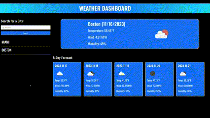

# Weather Dashboard

## Description
The Weather Dashboard is a web application built using HTML, CSS, Bootstrap, JavaScript, JQuery, Google Fonts, and the [OpenWeatherMap](https://openweathermap.org/api) APIs.

Users enter a city name, and OpenWeatherMap's [Geocoding API](https://openweathermap.org/api/geocoding-api) converts the city name to coordinates. The coordinates are then used to get the current weather from OpenWeatherMap's [Current Weather Data API](https://openweathermap.org/current), and the Five Day Forecast from OpenWeatherMap's [5 Day Weather Forecast API](https://openweathermap.org/forecast5).

When users search a city, the city's name is saved in local storage and displayed on the page. Users may then click on a previously searched city to redisplay its forecast.

## Visuals
The gif below shows the functionality of the Weather Dashboard.

## Installation
1. Clone the repository to your machine
2. Copy the files to your own repository
3. Conduct the git add, commit, and push commands to update your repository with the copied files
4. Modify the code to meet your needs
5. Commit and push your changes

## Links
- [Deployed Website](https://hwoolford.github.io/weather-dashboard/)

- [GitHub Repository](https://github.com/hwoolford/weather-dashboard)

## Resources and Acknowledgments
- [How to Convert a Unix Timestamp to Time in JavaScript](https://www.tutorialrepublic.com/faq/how-to-convert-a-unix-timestamp-to-time-in-javascript.php)

- I would like to acknowledge the assistance provided by Xpert, an AI Learning Assistant, in providing guidance and support throughout the development of this project. Xpert's insights and suggestions were invaluable in helping me overcome challenges and improve the quality of my work. (Acknowledgement written by Xpert)